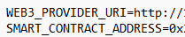
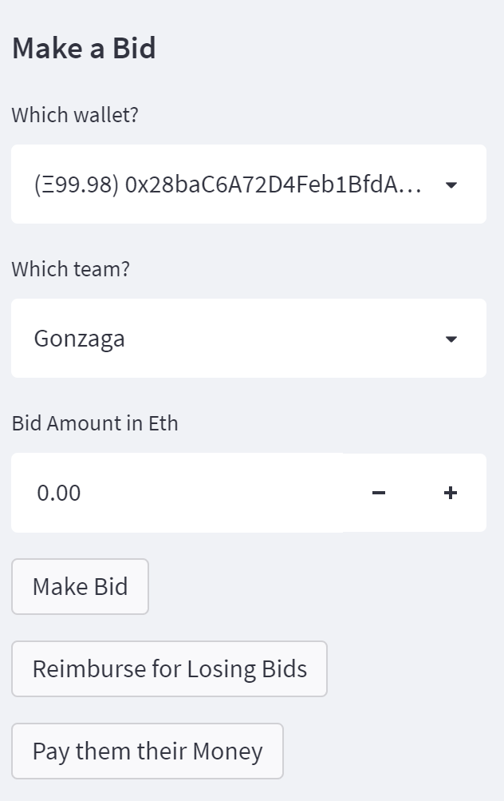
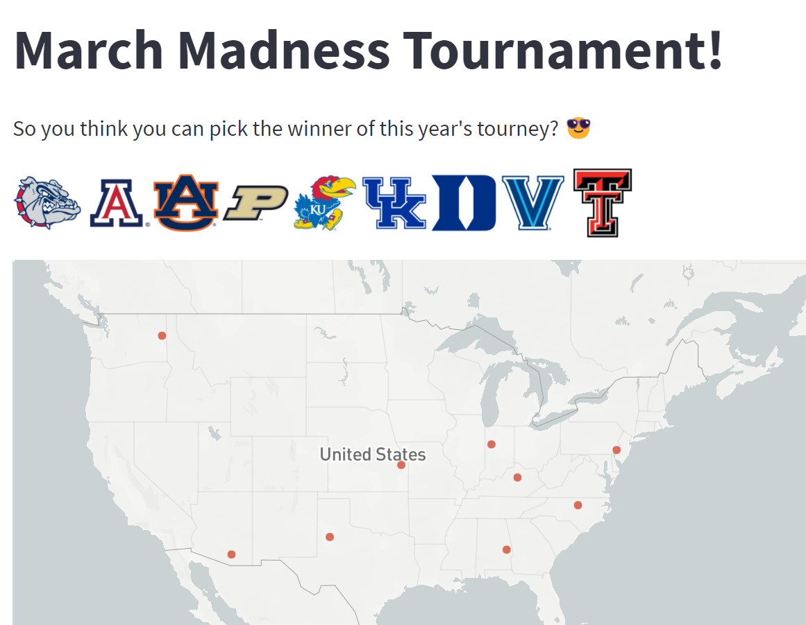
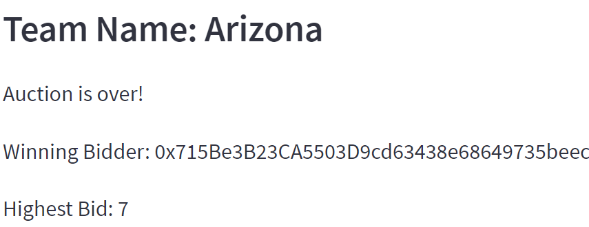
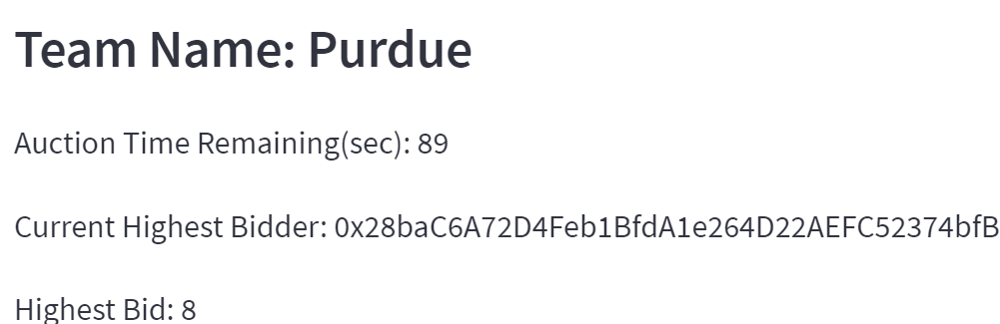

# March MadnETH 
## Calcutta Betting with Smart Contracts

## Table of Contents:
####
- Project Overview
- What is a Calcutta?
- March MadnETH Calcutta rules
- How to use the App
- Technologies
---
## Project Overview
### Project Goal:
####
- Create a novel sports betting app using the interactive features in the Steamlit GUI
- Deploy smart contracts to the ETH blockchain for wagering and payout utilities
- Write contract in Solidity through the use of Remix IDE
- Users can bid on auctions in a Calcutta betting pool
- Utilize Chainlink to verify the NCAA March Madness Finals winner on 4/4/2022 via ESPN free API (http://site.api.espn.com/apis/site/v2/sports/basketball/mens-college-basketball/scoreboard)

## What is a Calcutta?
####
- In sports betting, a Calcutta is analogous to an open auction
- Calcuttas are popular in sports with non-binary outcomes and/or a large number of contestants.  Examples include:
    - Horse racing
    - Golf tournaments
    - The NCAA Tournament
- We chose a Calcutta format to create a web-hosted sports betting application that is both interactive with blockchain, and is the first of its kind (as far as we can tell)

## March MadnETH Calcutta Rules
####
- Fixed and uniform buy-in in ETH
- Teams are auctioned off in random order
- Each bidding period has a time limit; this is currently set at 120 seconds for demo purposes
- Player with the highest bid will win ownership of a team
- Player who owns the team that wins the tournament will win the full pot!

## Chainlink Oracle
####
- Chainlink is a decentralized oracle protocol that allows real world data to be imported to the blockchain
- Our smart contract, written in solidity, sends a job request to the Chainlink network
- The job request sends an API request link as well as the specific location of the data required within the JSON file
- The job request also offers a reward in Chainlink's native tokens "LINK" to any nodes that do the work to verify the data and put it on the blockchain
- Our smart contract can then read this data from the Chainlink blockchain and use the winning team to verify and pay the winner of our Calcutta!

## Installation Guide

Install streamlit through the command **pip install streamlit**

Install streamlit_autorefresh through the command **pip install streamlit_autorefresh**

Install web3 through the command **pip install web3==5.17**

Install os through the command **pip install os_sys**


## Technologies
##### The following Python libraries were imported
```
# Import the required libraries and dependencies
import streamlit as st
import os
import json
import pandas as pd
import numpy as np
from web3 import Web3
from pathlib import Path
from dotenv import load_dotenv
from datetime import datetime
from streamlit_autorefresh import st_autorefresh
```

Remix IDE was also used for the smart contract development.  The website is **https://remix.ethereum.org**

## How to enter the pool and use The App
####
- Create API.env file with smart contract address and web3 provider; then use the command **streamlit run app.py** in a terminal
- The dashboard will show you the teams in play and the current status of all the auctions
- The sidebar has the functionality to make a bid through dropdown menus for account and team along with a field for bid amount
- Once an auction starts, the dashboard will display 3 items:
    - Time remaining
    - Winning Bidder
    - Highest Bid
- Each participant will have the opportunity to submit higher bids until time runs out
- For a starting bid, the participant will deposit money into the contract mapped to the selected team
- For a follow-on bid, the participant will deposit additional money into the contract
- After time runs out, the contract will no longer accept bids and the winning bidder will be displayed on the dashboard
- Losing bids will be refunded upon auction close through clicking a single button
- Total pot size will be displayed at the bottom of the dashboard


## Content

API.env file example 



Here are some images that illustrate how the Calcutta works

Sidebar with buttons for bid, reclaiming losing bids, giving pot to winner



Teams In Pool



Arizona Auction Winner



Auction In Progress



Pot Size


## Contributors
Ahmad Sadraei 
Vishnu Kurella: vishnu.kurella@gmail.com,
Lee Copeland: lcopeland44@gmail.com, 
Ling Zhou: lzhou1688@gmail.com

## License
Blitz.LQA 2021
